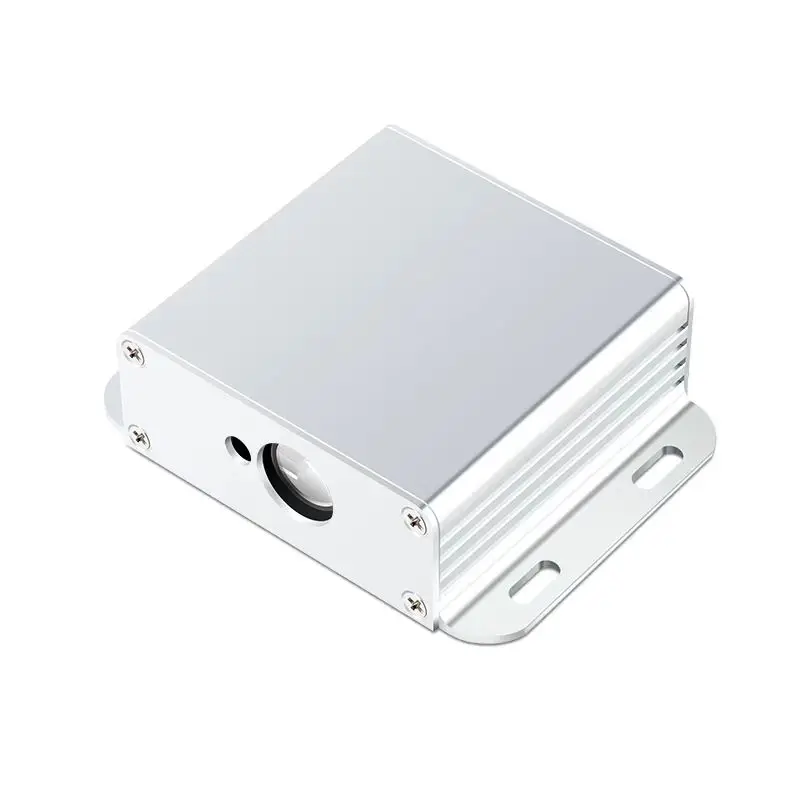
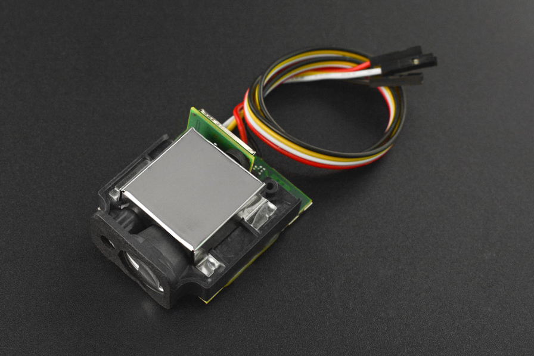
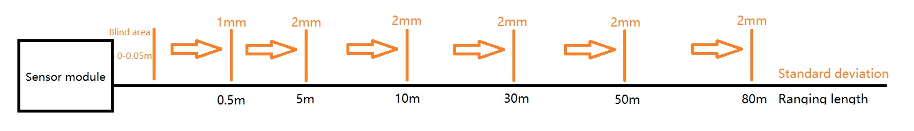
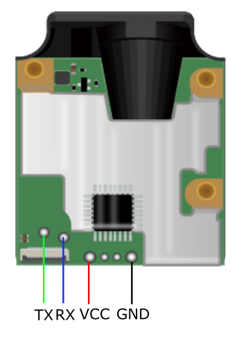

# serial-laser-ranger

[](https://pypi.org/project/serial-laser-ranger/)
[](https://opensource.org/licenses/MIT)
[](https://deepwiki.com/SamSkjord/serial-laser-ranger)

Python library for serial laser distance measurement modules.

<p align="center">
  
  
</p>

Works with generic laser ranging modules commonly found on AliExpress, as well as compatible units like the DFRobot SEN0366. These modules communicate via serial (UART) at 9600 baud.

## Specifications

| Parameter | Value |
|-----------|-------|
| Operating Voltage | DC 3.3V - 5V |
| Measuring Range | Indoor: 0.05 - 50m, Outdoor: 0.05 - 80m |
| Accuracy | ±1.0mm (standard deviation) |
| Laser Type | 620 - 690nm, Class II (<1mW) |
| Laser Spot | 6mm @ 10m, 30mm @ 50m |
| Measurement Time | 0.05 - 1s |
| Operating Temperature | -10°C to +60°C |
| Dimensions | 48 × 42 × 18mm |
| Weight | ~60g |
| Protection | IP40 |

> **Note:** Performance may degrade in strong ambient light, extreme temperatures, or with poorly reflective surfaces.

<p align="center">
  
</p>

## Installation

```bash
pip install serial-laser-ranger
```

## Quick Start

```python
from serial_laser_ranger import LaserRanger

with LaserRanger("/dev/ttyUSB0") as ranger:
    distance = ranger.measure_single()
    print(f"{distance:.3f} m")
```

Or even simpler:

```python
from serial_laser_ranger import measure

print(f"{measure('/dev/ttyUSB0'):.3f} m")
```

## Features

- Single and continuous measurement modes
- Laser on/off control
- Configurable resolution (1mm or 0.1mm)
- Configurable range (5m to 80m)
- Adjustable measurement frequency
- Distance offset calibration
- Error handling with descriptive messages

## Usage

### Basic Measurement

```python
from serial_laser_ranger import LaserRanger

with LaserRanger("/dev/ttyUSB0") as ranger:
    distance = ranger.measure_single()
    print(f"Distance: {distance:.3f} m")
```

### Continuous Measurement

```python
with LaserRanger("/dev/ttyUSB0") as ranger:
    # Take 10 measurements
    for distance in ranger.measure_continuous(count=10):
        print(f"{distance:.3f} m")

    # Or run indefinitely (Ctrl+C to stop)
    for distance in ranger.measure_continuous():
        print(f"{distance:.3f} m")
```

### With Callback

```python
def on_measurement(distance):
    print(f"Distance: {distance:.3f} m")

with LaserRanger("/dev/ttyUSB0") as ranger:
    for _ in ranger.measure_continuous(callback=on_measurement, count=100):
        pass
```

### Configuration

```python
with LaserRanger("/dev/ttyUSB0") as ranger:
    # Set 0.1mm resolution
    ranger.set_resolution(LaserRanger.RESOLUTION_01MM)

    # Set 30m range
    ranger.set_range(LaserRanger.RANGE_30M)

    # Set 20 Hz measurement frequency
    ranger.set_frequency(20)

    # Apply distance offset (e.g., for mounting offset)
    ranger.set_distance_offset(50)  # +50mm offset
```

### Laser Control

```python
with LaserRanger("/dev/ttyUSB0") as ranger:
    ranger.laser_on()   # Turn laser on
    ranger.laser_off()  # Turn laser off
```

### Error Handling

```python
from serial_laser_ranger import LaserRanger, LaserRangerError

with LaserRanger("/dev/ttyUSB0") as ranger:
    try:
        distance = ranger.measure_single()
    except LaserRangerError as e:
        print(f"Error {e.code}: {e.message}")
```

Error codes:
- `ERR-1e`: Low power
- `ERR-14`: Calculation error
- `ERR-15`: Laser low power
- `ERR-18`: Weak signal or measurement time too long
- `ERR-20`: Strong ambient light
- `ERR-74`: Out of range

## API Reference

### LaserRanger

#### Constructor

```python
LaserRanger(
    port="/dev/ttyUSB0",  # Serial port
    baudrate=9600,         # Baud rate (default 9600)
    timeout=2.0,           # Read timeout in seconds
    address=0x80           # Device address (default 128)
)
```

#### Methods

| Method | Description |
|--------|-------------|
| `measure_single()` | Take a single measurement, returns distance in meters |
| `measure_continuous(callback=None, count=0)` | Generator yielding continuous measurements |
| `laser_on()` | Turn the laser on |
| `laser_off()` | Turn the laser off |
| `set_resolution(resolution)` | Set measurement resolution |
| `set_range(range_m)` | Set measurement range |
| `set_frequency(freq)` | Set measurement frequency (Hz) |
| `set_distance_offset(offset_mm, negative=False)` | Set distance offset |
| `set_start_point(from_top)` | Set measurement reference point |
| `set_power_on_start(enabled)` | Enable/disable auto-start on power |

#### Constants

| Constant | Value | Description |
|----------|-------|-------------|
| `RESOLUTION_1MM` | 0x01 | 1mm resolution |
| `RESOLUTION_01MM` | 0x02 | 0.1mm resolution |
| `RANGE_5M` | 0x05 | 5 meter range |
| `RANGE_10M` | 0x0A | 10 meter range |
| `RANGE_30M` | 0x12 | 30 meter range |
| `RANGE_50M` | 0x32 | 50 meter range |
| `RANGE_80M` | 0x50 | 80 meter range |

## Hardware

<p align="center">
  
</p>

### Wiring

| Module Pin | Connection |
|------------|------------|
| VCC | 5V |
| GND | Ground |
| TX | RX on USB-Serial adapter |
| RX | TX on USB-Serial adapter |

### Serial Settings

- Baud rate: 9600
- Data bits: 8
- Stop bits: 1
- Parity: None

## Examples

See `examples.py` for practical examples including:
- Basic measurement
- Statistics collection
- Real-time monitoring
- CSV logging
- Motion detection
- Calibration checking

Run examples with:
```bash
python examples.py basic
python examples.py statistics
python examples.py monitor
```

## Applications

- UAV automatic landing
- Robotics distance sensing
- Industrial level monitoring
- Electronic measurement tools
- Security systems

## References

- [DFRobot SEN0366 Wiki](https://wiki.dfrobot.com/Infrared_Laser_Distance_Sensor_50m_80m_SKU_SEN0366) - Detailed documentation and specifications
- [Electromaker Product Page](https://www.electromaker.io/shop/product/infrared-laser-distance-sensor-50m80m) - Additional product information

## License

MIT License
